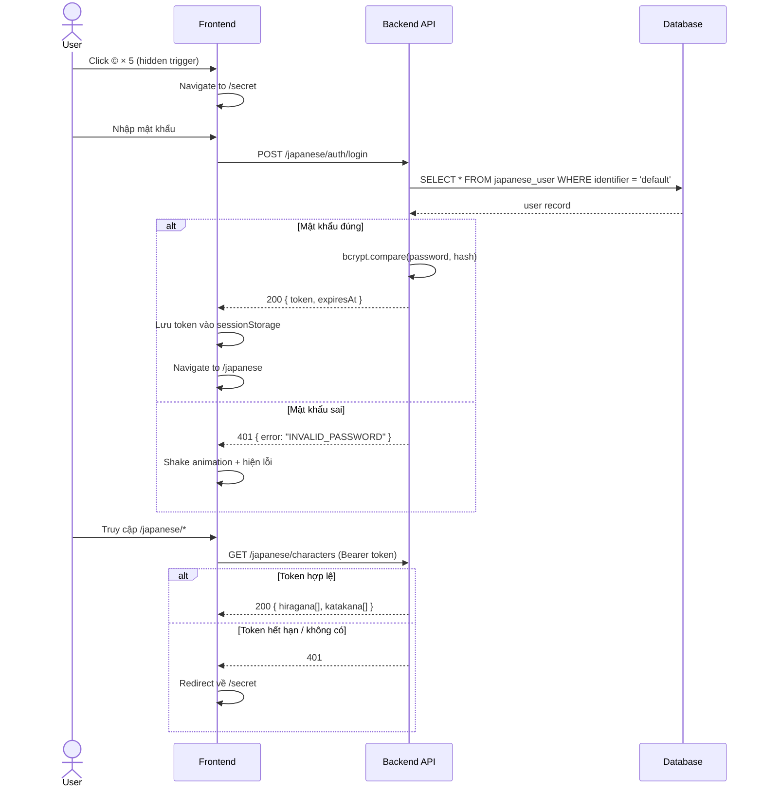
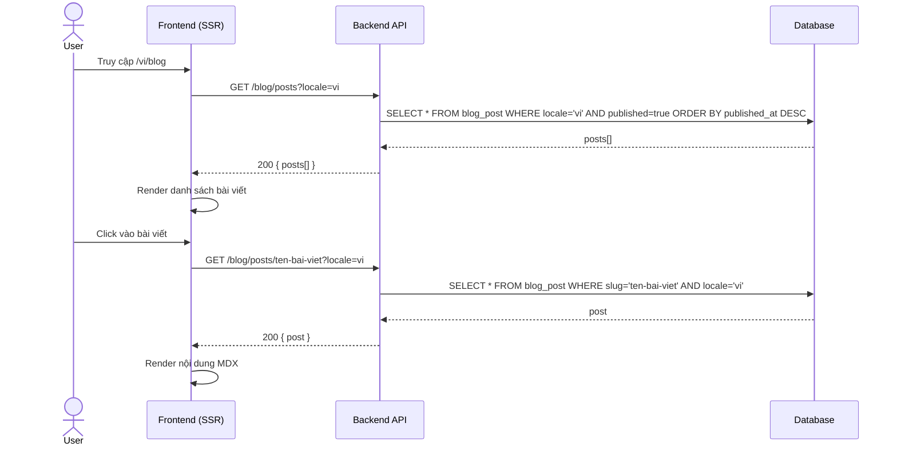
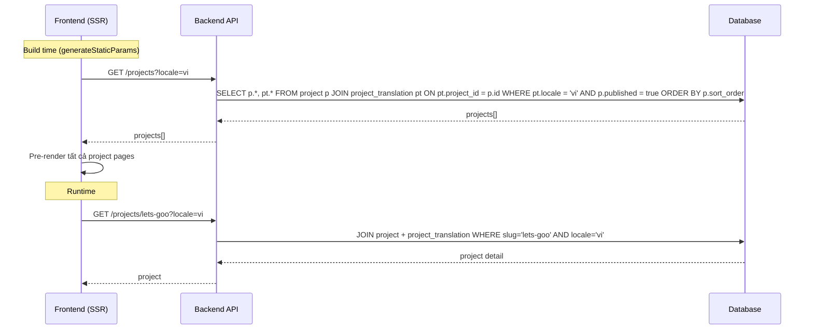
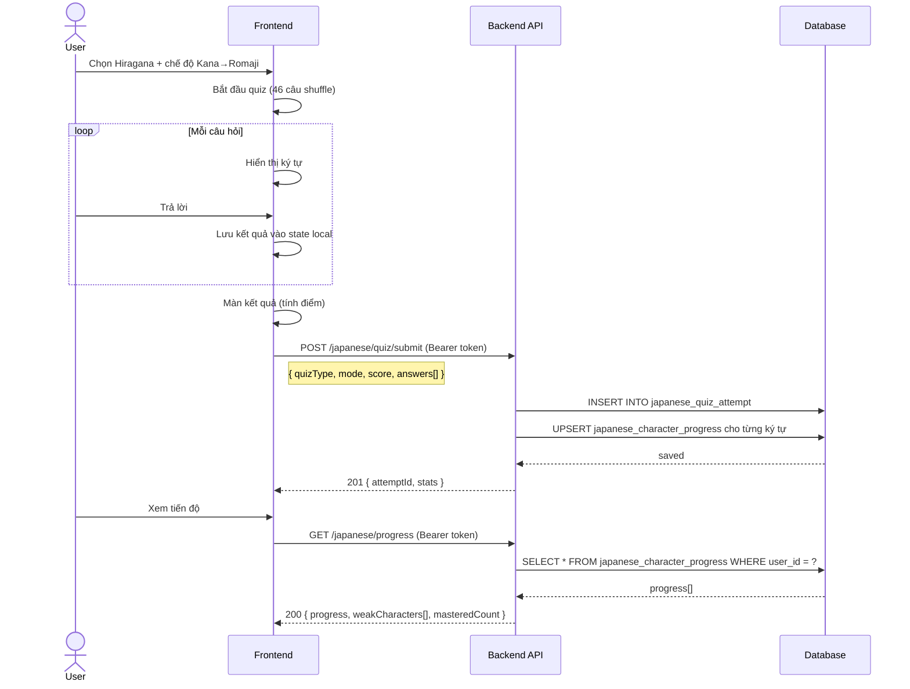
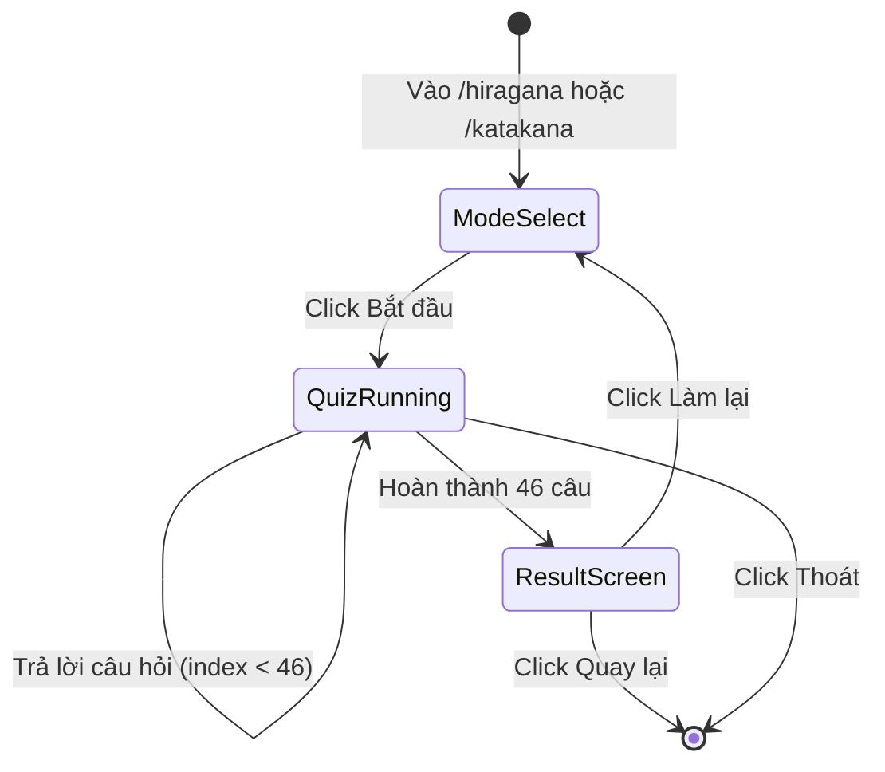
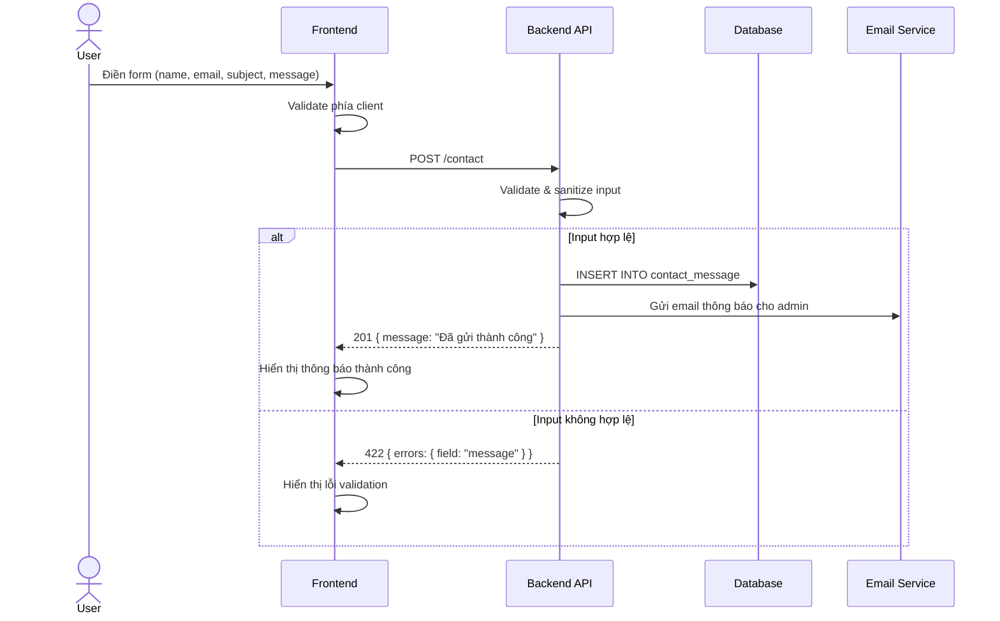
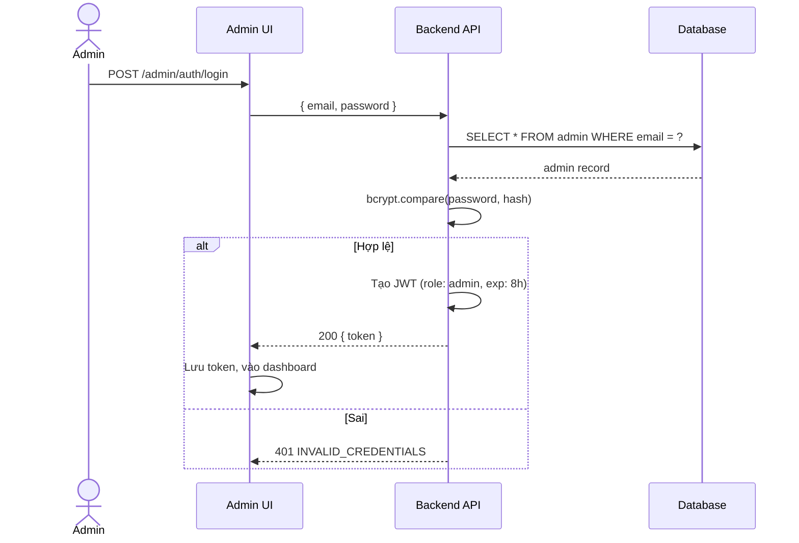
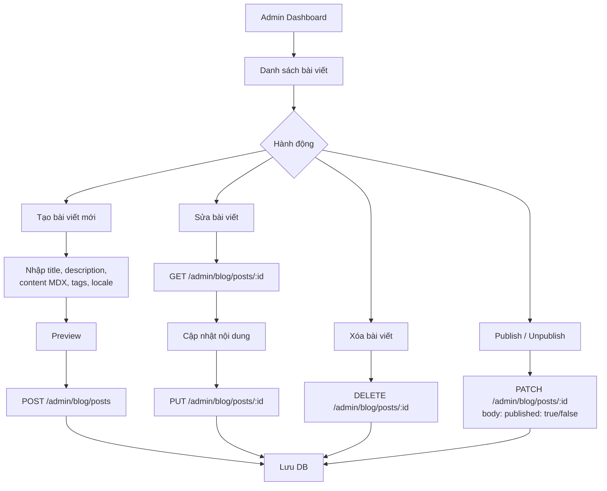

# Backend API Specification — Portfolio

> Tài liệu thiết kế API & Database cho backend của portfolio.  
> Đủ để dev đọc và triển khai độc lập.

---

## Mục lục

1. [Tổng quan kiến trúc](#1-tổng-quan-kiến-trúc)
2. [Database Schema](#2-database-schema)
3. [API Overview](#3-api-overview)
4. [Auth — Japanese Section](#4-auth--japanese-section)
5. [Blog](#5-blog)
6. [Projects](#6-projects)
7. [Profile & Content](#7-profile--content)
8. [Japanese Quiz & Progress](#8-japanese-quiz--progress)
9. [Contact Form](#9-contact-form)
10. [Admin CMS](#10-admin-cms)

---

## 1. Tổng quan kiến trúc

```
┌─────────────────────────────────────────────┐
│              Next.js Frontend               │
│  (Static site + Client components)          │
└──────────────────────┬──────────────────────┘
                       │ HTTP/REST
┌──────────────────────▼──────────────────────┐
│              Backend API Server             │
│   (Node.js / NestJS / Express)              │
│                                             │
│  /api/auth          /api/blog               │
│  /api/profile       /api/projects           │
│  /api/japanese      /api/contact            │
│  /api/admin/*                               │
└──────────────────────┬──────────────────────┘
                       │
        ┌──────────────┴──────────────┐
        │                             │
┌───────▼──────┐             ┌────────▼──────┐
│  PostgreSQL  │             │     Redis     │
│  (main DB)   │             │   (session/   │
│              │             │    cache)     │
└──────────────┘             └───────────────┘
```

### Ngôn ngữ / Locale

Hỗ trợ 3 locale: `en`, `vi`, `ja`

Header mặc định cho các request cần locale: `Accept-Language: vi`  
Hoặc query param: `?locale=vi`

---

## 2. Database Schema

### Entity Relationship Diagram

```mermaid
erDiagram
    ADMIN {
        uuid id PK
        string email
        string password_hash
        timestamp created_at
    }

    PROFILE {
        uuid id PK
        string name
        string title
        string email
        string phone
        string location
        string date_of_birth
        json social_links
        timestamp updated_at
    }

    PROJECT {
        uuid id PK
        string slug
        string category
        string company
        string period
        int team_size
        string[] tech_stack
        int sort_order
        boolean published
        timestamp created_at
        timestamp updated_at
    }

    PROJECT_TRANSLATION {
        uuid id PK
        uuid project_id FK
        string locale
        string title
        text description
        text long_description
        text[] highlights
        text[] responsibilities
    }

    EXPERIENCE {
        uuid id PK
        string company
        string period
        string[] tech_stack
        int sort_order
        timestamp created_at
    }

    EXPERIENCE_TRANSLATION {
        uuid id PK
        uuid experience_id FK
        string locale
        string role
        text description
        text[] responsibilities
    }

    SKILL_CATEGORY {
        uuid id PK
        string i18n_key
        int sort_order
    }

    SKILL_CATEGORY_TRANSLATION {
        uuid id PK
        uuid category_id FK
        string locale
        string name
    }

    SKILL {
        uuid id PK
        uuid category_id FK
        string name
        int sort_order
    }

    EDUCATION {
        uuid id PK
        string school
        string major
        string start_year
        string end_year
        string status
    }

    BLOG_POST {
        uuid id PK
        string slug
        string locale
        string title
        text description
        text content
        string[] tags
        boolean published
        date published_at
        int reading_time
        timestamp created_at
        timestamp updated_at
    }

    CONTACT_MESSAGE {
        uuid id PK
        string name
        string email
        string subject
        text message
        boolean read
        timestamp sent_at
    }

    JAPANESE_USER {
        uuid id PK
        string identifier
        string password_hash
        timestamp created_at
    }

    JAPANESE_QUIZ_ATTEMPT {
        uuid id PK
        uuid user_id FK
        string quiz_type
        string mode
        int score
        int total
        json answers
        timestamp attempted_at
    }

    JAPANESE_CHARACTER_PROGRESS {
        uuid id PK
        uuid user_id FK
        string character
        string quiz_type
        int attempt_count
        int correct_count
        timestamp last_attempted
    }

    PROJECT ||--o{ PROJECT_TRANSLATION : has
    EXPERIENCE ||--o{ EXPERIENCE_TRANSLATION : has
    SKILL_CATEGORY ||--o{ SKILL_CATEGORY_TRANSLATION : has
    SKILL_CATEGORY ||--o{ SKILL : contains
    JAPANESE_USER ||--o{ JAPANESE_QUIZ_ATTEMPT : makes
    JAPANESE_USER ||--o{ JAPANESE_CHARACTER_PROGRESS : tracks
```



### Mô tả các bảng chính

| Bảng | Mô tả |
|---|---|
| `admin` | Tài khoản quản trị CMS |
| `profile` | Thông tin cá nhân (1 record duy nhất) |
| `project` + `project_translation` | Dự án, hỗ trợ đa ngôn ngữ |
| `experience` + `experience_translation` | Kinh nghiệm làm việc |
| `skill_category` + `skill` | Nhóm kỹ năng + từng kỹ năng |
| `education` | Học vấn |
| `blog_post` | Bài viết blog (mỗi bản dịch = 1 record riêng) |
| `contact_message` | Tin nhắn liên hệ |
| `japanese_user` | Người dùng section tiếng Nhật |
| `japanese_quiz_attempt` | Lịch sử làm quiz |
| `japanese_character_progress` | Tiến độ từng ký tự |

---

## 3. API Overview

### Base URL
```
https://api.yourportfolio.com/v1
```

### Tất cả endpoints

| Method | Endpoint | Auth | Mô tả |
|---|---|---|---|
| GET | `/profile` | — | Lấy thông tin cá nhân |
| GET | `/projects` | — | Danh sách dự án |
| GET | `/projects/:slug` | — | Chi tiết dự án |
| GET | `/experiences` | — | Danh sách kinh nghiệm |
| GET | `/skills` | — | Danh sách kỹ năng |
| GET | `/education` | — | Thông tin học vấn |
| GET | `/blog/posts` | — | Danh sách bài viết |
| GET | `/blog/posts/:slug` | — | Chi tiết bài viết |
| POST | `/contact` | — | Gửi tin nhắn liên hệ |
| POST | `/japanese/auth/login` | — | Đăng nhập section Nhật |
| POST | `/japanese/auth/logout` | Bearer | Đăng xuất |
| GET | `/japanese/characters` | Bearer | Lấy dữ liệu kana |
| POST | `/japanese/quiz/submit` | Bearer | Nộp kết quả quiz |
| GET | `/japanese/progress` | Bearer | Lấy tiến độ học |
| GET | `/japanese/progress/stats` | Bearer | Thống kê chi tiết |
| POST | `/admin/auth/login` | — | Đăng nhập admin |
| POST | `/admin/auth/logout` | Admin | Đăng xuất admin |
| GET | `/admin/contact-messages` | Admin | Danh sách tin nhắn |
| PATCH | `/admin/contact-messages/:id` | Admin | Đánh dấu đã đọc |
| PUT | `/admin/profile` | Admin | Cập nhật profile |
| POST | `/admin/projects` | Admin | Tạo dự án |
| PUT | `/admin/projects/:id` | Admin | Cập nhật dự án |
| DELETE | `/admin/projects/:id` | Admin | Xóa dự án |
| POST | `/admin/experiences` | Admin | Tạo kinh nghiệm |
| PUT | `/admin/experiences/:id` | Admin | Cập nhật kinh nghiệm |
| DELETE | `/admin/experiences/:id` | Admin | Xóa kinh nghiệm |
| POST | `/admin/blog/posts` | Admin | Tạo bài viết |
| PUT | `/admin/blog/posts/:id` | Admin | Cập nhật bài viết |
| DELETE | `/admin/blog/posts/:id` | Admin | Xóa bài viết |

### Response format chuẩn

```json
// Success
{
  "success": true,
  "data": { ... }
}

// Error
{
  "success": false,
  "error": {
    "code": "INVALID_PASSWORD",
    "message": "Mật khẩu không đúng"
  }
}
```

---

## 4. Auth — Japanese Section

### Luồng xác thực



### POST `/japanese/auth/login`

**Request**
```json
{
  "password": "051020"
}
```

**Response 200**
```json
{
  "success": true,
  "data": {
    "token": "eyJhbGciOiJIUzI1NiIsInR5cCI6IkpXVCJ9...",
    "expiresAt": "2026-04-07T12:00:00Z"
  }
}
```

**Response 401**
```json
{
  "success": false,
  "error": {
    "code": "INVALID_PASSWORD",
    "message": "Mật khẩu không đúng"
  }
}
```

> Token là JWT, expire sau **24h** (session-based). Lưu ở `sessionStorage` phía FE.

---

## 5. Blog

### Luồng đọc blog



### GET `/blog/posts`

**Query params**

| Param | Type | Default | Mô tả |
|---|---|---|---|
| `locale` | `en` \| `vi` \| `ja` | `en` | Ngôn ngữ |
| `page` | number | `1` | Trang |
| `limit` | number | `10` | Số bài mỗi trang |
| `tag` | string | — | Lọc theo tag |

**Response 200**
```json
{
  "success": true,
  "data": {
    "posts": [
      {
        "id": "uuid",
        "slug": "ten-bai-viet",
        "locale": "vi",
        "title": "Tiêu đề bài viết",
        "description": "Mô tả ngắn",
        "tags": ["react", "typescript"],
        "publishedAt": "2026-04-01",
        "readingTime": 5
      }
    ],
    "pagination": {
      "total": 20,
      "page": 1,
      "limit": 10,
      "totalPages": 2
    }
  }
}
```

### GET `/blog/posts/:slug`

**Query params**: `locale`

**Response 200**
```json
{
  "success": true,
  "data": {
    "id": "uuid",
    "slug": "ten-bai-viet",
    "locale": "vi",
    "title": "Tiêu đề",
    "description": "Mô tả",
    "content": "# Nội dung MDX...",
    "tags": ["react"],
    "publishedAt": "2026-04-01",
    "readingTime": 5
  }
}
```

**Response 404**
```json
{
  "success": false,
  "error": { "code": "POST_NOT_FOUND", "message": "Bài viết không tồn tại" }
}
```

---

## 6. Projects

### Luồng hiển thị project



### GET `/projects`

**Query params**: `locale`, `category` (`web` | `mobile` | `fullstack`)

**Response 200**
```json
{
  "success": true,
  "data": {
    "projects": [
      {
        "id": "uuid",
        "slug": "lets-goo",
        "category": "web",
        "company": "Katech",
        "period": "2023 - Present",
        "teamSize": 5,
        "techStack": ["React", "TypeScript", "Next.js"],
        "title": "Let's Goo",
        "description": "Mô tả ngắn",
        "highlights": ["Feature 1", "Feature 2"]
      }
    ]
  }
}
```

### GET `/projects/:slug`

**Response 200**
```json
{
  "success": true,
  "data": {
    "id": "uuid",
    "slug": "lets-goo",
    "category": "web",
    "company": "Katech",
    "period": "2023 - Present",
    "teamSize": 5,
    "techStack": ["React", "TypeScript"],
    "title": "Let's Goo",
    "description": "Mô tả ngắn",
    "longDescription": "Mô tả chi tiết dài...",
    "highlights": ["Feature 1", "Feature 2", "Feature 3"],
    "responsibilities": ["Trách nhiệm 1", "Trách nhiệm 2"]
  }
}
```

---

## 7. Profile & Content

### GET `/profile`

**Response 200**
```json
{
  "success": true,
  "data": {
    "name": "Ha Duy Hung",
    "title": "Front-end Developer",
    "email": "haduyhungdz123@gmail.com",
    "phone": "0353087299",
    "location": "Ha Noi, Vietnam",
    "dateOfBirth": "05-10-2000",
    "socialLinks": {
      "github": "https://github.com/haduyhung",
      "facebook": "https://facebook.com/...",
      "email": "mailto:haduyhungdz123@gmail.com"
    }
  }
}
```

### GET `/experiences`

**Query params**: `locale`

**Response 200**
```json
{
  "success": true,
  "data": {
    "experiences": [
      {
        "id": "uuid",
        "company": "Katech",
        "period": "2023 - Present",
        "techStack": ["React", "TypeScript"],
        "role": "Frontend Developer",
        "description": "Mô tả công việc...",
        "responsibilities": ["Trách nhiệm 1", "Trách nhiệm 2"]
      }
    ]
  }
}
```

### GET `/skills`

**Query params**: `locale`

**Response 200**
```json
{
  "success": true,
  "data": {
    "categories": [
      {
        "id": "uuid",
        "name": "Frontend Core",
        "skills": ["React", "Next.js", "TypeScript", "JavaScript"]
      }
    ]
  }
}
```

### GET `/education`

**Response 200**
```json
{
  "success": true,
  "data": {
    "school": "Đại học Bách Khoa Hà Nội",
    "major": "Công nghệ thông tin",
    "startYear": "2018",
    "endYear": "2023",
    "status": "Tốt nghiệp"
  }
}
```

---

## 8. Japanese Quiz & Progress

### Luồng làm quiz và lưu kết quả



### Luồng trạng thái quiz



### POST `/japanese/quiz/submit`

**Headers**: `Authorization: Bearer <token>`

**Request**
```json
{
  "quizType": "hiragana",
  "mode": "kana",
  "score": 38,
  "total": 46,
  "answers": [
    {
      "character": "あ",
      "romaji": "a",
      "userAnswer": "a",
      "correct": true
    },
    {
      "character": "し",
      "romaji": "shi",
      "userAnswer": "si",
      "correct": true
    },
    {
      "character": "ち",
      "romaji": "chi",
      "userAnswer": "ki",
      "correct": false
    }
  ]
}
```

**Response 201**
```json
{
  "success": true,
  "data": {
    "attemptId": "uuid",
    "score": 38,
    "total": 46,
    "accuracy": 82.6,
    "weakCharacters": ["ち", "つ", "ふ"]
  }
}
```

### GET `/japanese/progress`

**Headers**: `Authorization: Bearer <token>`

**Query params**: `quizType` (`hiragana` | `katakana` | `all`)

**Response 200**
```json
{
  "success": true,
  "data": {
    "summary": {
      "hiragana": {
        "masteredCount": 32,
        "totalCount": 46,
        "masteryPercent": 69.6,
        "totalAttempts": 5
      },
      "katakana": {
        "masteredCount": 10,
        "totalCount": 46,
        "masteryPercent": 21.7,
        "totalAttempts": 2
      }
    },
    "weakCharacters": [
      {
        "character": "ち",
        "quizType": "hiragana",
        "correctCount": 1,
        "attemptCount": 5,
        "accuracy": 20
      }
    ],
    "recentAttempts": [
      {
        "id": "uuid",
        "quizType": "hiragana",
        "mode": "kana",
        "score": 38,
        "total": 46,
        "attemptedAt": "2026-04-07T10:30:00Z"
      }
    ]
  }
}
```

> **Mastered**: Ký tự được coi là "thành thạo" khi có `correctCount / attemptCount >= 0.8` và `attemptCount >= 3`.

---

## 9. Contact Form

### Luồng gửi liên hệ



### POST `/contact`

**Request**
```json
{
  "name": "Nguyen Van A",
  "email": "vana@gmail.com",
  "subject": "Cơ hội hợp tác",
  "message": "Xin chào, tôi muốn trao đổi về..."
}
```

**Validation rules**

| Field | Rule |
|---|---|
| `name` | Required, 2–100 ký tự |
| `email` | Required, valid email |
| `subject` | Required, 2–200 ký tự |
| `message` | Required, 10–2000 ký tự |

**Response 201**
```json
{
  "success": true,
  "data": {
    "message": "Tin nhắn đã được gửi thành công. Tôi sẽ phản hồi sớm nhất có thể!"
  }
}
```

**Response 422**
```json
{
  "success": false,
  "error": {
    "code": "VALIDATION_ERROR",
    "fields": {
      "email": "Email không hợp lệ",
      "message": "Nội dung quá ngắn (tối thiểu 10 ký tự)"
    }
  }
}
```

---

## 10. Admin CMS

### Luồng xác thực Admin



### POST `/admin/auth/login`

**Request**
```json
{ "email": "admin@portfolio.com", "password": "..." }
```

**Response 200**
```json
{
  "success": true,
  "data": { "token": "eyJ...", "expiresAt": "2026-04-08T10:00:00Z" }
}
```

### Luồng quản lý Blog



### POST `/admin/blog/posts`

**Headers**: `Authorization: Bearer <admin_token>`

**Request**
```json
{
  "slug": "ten-bai-viet",
  "locale": "vi",
  "title": "Tiêu đề bài viết",
  "description": "Mô tả ngắn",
  "content": "# Nội dung MDX\n\nBài viết...",
  "tags": ["react", "nextjs"],
  "published": false,
  "publishedAt": "2026-04-07"
}
```

**Response 201**
```json
{
  "success": true,
  "data": { "id": "uuid", "slug": "ten-bai-viet", "readingTime": 3 }
}
```

### Admin Contact Messages

**GET `/admin/contact-messages`**

**Response 200**
```json
{
  "success": true,
  "data": {
    "messages": [
      {
        "id": "uuid",
        "name": "Nguyen Van A",
        "email": "vana@gmail.com",
        "subject": "Cơ hội hợp tác",
        "message": "Xin chào...",
        "read": false,
        "sentAt": "2026-04-07T09:00:00Z"
      }
    ],
    "unreadCount": 3
  }
}
```

**PATCH `/admin/contact-messages/:id`**
```json
{ "read": true }
```

---

## Appendix: Error Codes

| Code | HTTP | Mô tả |
|---|---|---|
| `INVALID_PASSWORD` | 401 | Sai mật khẩu Japanese section |
| `INVALID_CREDENTIALS` | 401 | Sai email/pass admin |
| `UNAUTHORIZED` | 401 | Token thiếu hoặc hết hạn |
| `FORBIDDEN` | 403 | Không đủ quyền |
| `NOT_FOUND` | 404 | Resource không tồn tại |
| `VALIDATION_ERROR` | 422 | Input không hợp lệ |
| `SLUG_CONFLICT` | 409 | Slug đã tồn tại |
| `INTERNAL_ERROR` | 500 | Lỗi server |

## Appendix: Tech Stack gợi ý cho BE

| Layer | Gợi ý |
|---|---|
| Framework | NestJS hoặc Express + TypeScript |
| ORM | Prisma |
| Database | PostgreSQL |
| Cache / Session | Redis |
| Auth | JWT (`jsonwebtoken`) + bcrypt |
| Email | Nodemailer / Resend |
| File upload (nếu cần) | AWS S3 / Cloudflare R2 |
| Validation | Zod hoặc class-validator |
| Deploy | Railway / Render / VPS |
